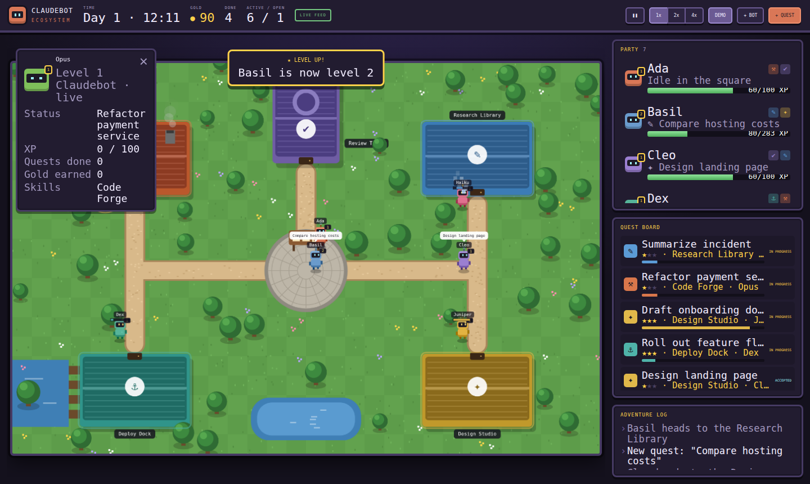

# Claudebot Ecosystem

A tiny video-game village where your Claudebots live and work. Each bot is a small robot that walks to a building, works on a quest there, earns XP and gold, and levels up. You can run it as a demo, or connect real Claude Code sessions so the village shows what your bots are actually doing.



## Run it

```bash
node server.js        # then open http://127.0.0.1:8787
```

No dependencies — just Node 18+. You can also open `index.html` directly for demo mode, but the live feed needs the server.

## The world

| Building | Quest type | Kind of work |
|---|---|---|
| ⚒ Code Forge | `code` | writing and fixing code |
| ✔ Review Tower | `review` | reviews, tests, audits |
| ✎ Research Library | `research` | investigating, reading, comparing |
| ⚓ Deploy Dock | `deploy` | releases, infra, migrations |
| ✦ Design Studio | `writing` | docs, copy, design |

- Idle bots hang out in the town square next to the quest board.
- Bots prefer quests that match their skills. They finish those faster and earn 50% more XP.
- A day lasts 4 minutes at 1x speed, and the village lights up at night.
- Click a bot to inspect it. **+ QUEST** posts a quest, **+ BOT** recruits a bot, and **DEMO** turns auto-generated quests on or off.
- Keys: `Space` pause, `1`/`2`/`3` speed, `Q` new quest, `Esc` deselect.

Bots, buildings, demo quests and pacing all live in [`src/config.js`](src/config.js).

## Connect real bots

Anything that can send an HTTP POST can report to the village:

```bash
curl -X POST http://127.0.0.1:8787/api/events \
  -d '{"bot":"Ada","status":"started","title":"Fix login bug","type":"code","id":"task-1"}'

curl -X POST http://127.0.0.1:8787/api/events -d '{"bot":"Ada","status":"progress","progress":0.5,"id":"task-1"}'
curl -X POST http://127.0.0.1:8787/api/events -d '{"bot":"Ada","status":"completed","id":"task-1"}'   # or "failed"
```

- A bot name the village hasn't seen yet joins automatically and gets a **LIVE** tag.
- A live bot keeps working on a quest until it reports `completed` or `failed`.
- If a page opens while tasks are in progress, it picks them up right away.

### Claude Code sessions

[`examples/claude-hook.js`](examples/claude-hook.js) turns each prompt you send Claude Code into a quest. The quest completes when Claude finishes its reply. Merge [`examples/claude-settings.json`](examples/claude-settings.json) into your `~/.claude/settings.json` or a project's `.claude/settings.json`, and change the path to the hook script.

Optional environment variables:

- `CLAUDEBOT_NAME`: the bot's name. Defaults to the project folder name.
- `CLAUDEBOT_TYPE`: which building the bot works at. Defaults to a guess based on the prompt.
- `CLAUDEBOT_URL`: where to send events. Defaults to `http://127.0.0.1:8787/api/events`.

The hook gives up after 1.5 s and always exits cleanly, so it never slows Claude down.

## Files

- `index.html`, `styles.css`: the page and the game-style HUD
- `src/engine.js`: the simulation and canvas rendering
- `src/ui.js`: the party, quest board and log panels
- `src/feed.js`: polls the server for live events
- `server.js`: serves the game and the `/api/events` endpoint. It listens on 127.0.0.1 only unless you set `HOST`.
